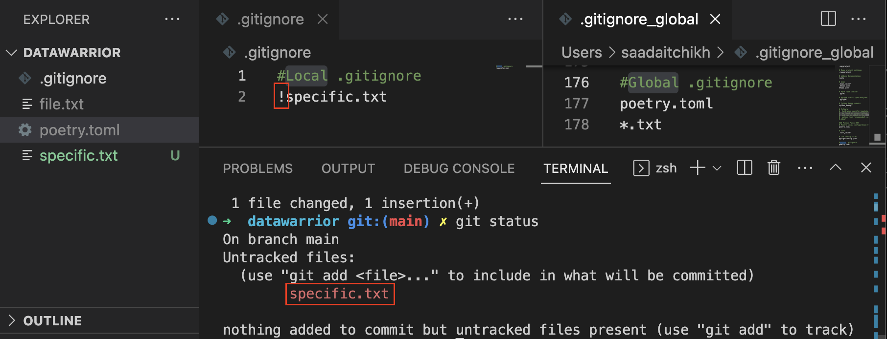

According to the [Git documentation](https://git-scm.com/docs/gitignore#_configuration), Git uses various sources to find patterns for files to ignore, including the familiar project-specific *.gitignore* file and patterns specified in the *core.excludesFile* configuration variable.

📝 Note that the local `.gitingore` file will always be more prioritized than the global one. (i.e. if a file is ignored in the global .gitignore file, but explicitly tracked in the local .gitignore file, it will be tracked, and vice versa)

*In this example, the file `specific.txt` is ignored globally but explicitly tracked locally, so it will be tracked.*

## Step 1: Create the Global *.gitignore*

Start by creating a global `.gitignore_global` file in your home directory :

```shell
touch ~/.gitignore_global # or any other file name
```

## Step 2: Adding Patterns to Ignore
Next, add patterns to this global `.gitignore_global` file. For instance, to ignore all log files, use the following command:

```shell
echo "*.log" >> ~/.gitignore_global
```
You can include as many patterns as you need.

## Step 3: Configuring Git

To make Git use your global *.gitignore*, you need to set the core.excludesFile configuration variable. Run the following command:

```python
git config --global core.excludesfile ~/.gitignore_global
```
And there you have it! You now have a global .gitignore that Git will use across all your projects.


> ## Bonus ✨ : Pre-made global *.gitignore*
> You can find pre-made global `.gitignore` files for various programming languages and tools at [gitignore.io](https://www.toptal.com/developers/gitignore).

