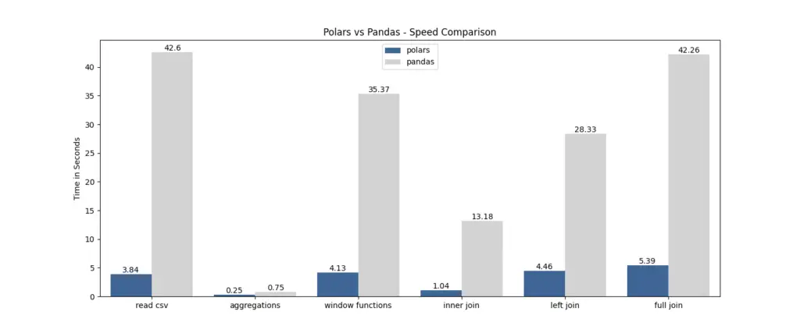

*Pandas* is super famous for managing and analyzing data. If you are a *datawarrior*, you've probably heard of it, and maybe you use it every day. It's handy for many data tasks, but some people complain about how slow it can be sometimes.

Now, there's a new kid on the block called Polars. It's faster than Pandas. *Polars* is written in a programming language called Rust, and even though it's quite new, it's catching attention.

*Pandas* is great because it's flexible and easy to use, but when you're working with really huge datasets, it can get stuck and slow things down. This is because it mainly uses one part of your computer to do the work. So, as your data gets bigger, it takes more time, which is not good for your productivity.

*Polars*, on the other hand, is excellent at handling large amounts of data quickly. It spreads the work across many parts of your computer, so it's like having a whole team working together. This makes your data tasks way faster.

Want to see the proof?  [Check out](https://stuffbyyuki.com/pandas-vs-polars-speed-comparison/?utm_content=cmp-true) this speed test. The results are right there in the picture below! 😊



💡 Impressed by the speed and performance results, I'm sure you're eager to start using Polars over Pandas in the future. Let's get you started by showing you how to install it and then explore some common data manipulation functions with Polars.

# Installation:
To install *Polars*, you can use pip (or conda). Open your terminal or command prompt and run this command:
```shell
pip install polars
```
Make sure you have Python installed on your computer before running this.

# Getting Started with Polars:

Now that you've got *Polars* installed, let's dive into the basics of using *Polars* for data manipulation. *Polars* is known for its straightforward and intuitive syntax, which makes it easy to work with. Here are some common data manipulation functions and how to use them:
## 1. Loading Data:
You can read data from various sources, such as CSV files, Parquet files and more. For example, to read a CSV file:
```shell
import polars as pl

data = pl.read_csv("datawarrior.csv")
data.head()
```
## 2. Selecting Columns:

To select specific columns from your data, you can use the `select` method:
```shell
selected_data = data.select(["column_name1", "column_name2"])
```
## 3. Filtering Data:

You can filter your data based on conditions using the `filter` method:
```shell
filtered_data = data.filter(pl.col("column_name") > 10)
```
## 4. Aggregating Data:

To perform aggregation operations like `sum`, `mean`, or `count`, you can use the `groupby` method:
```shell
aggregated_data = data.groupby("group_column").agg(pl.col("agg_column").sum())
```
## 5. Sorting Data:

To sort your data, you can use the `sort` method:
```shell
sorted_data = data.sort(by="column_name")
```

These are just some of the common operations you can perform with Polars. 

> ## Bonus ✨ : Polars cheat sheet
> This [cheat sheet](https://franzdiebold.github.io/polars-cheat-sheet/Polars_cheat_sheet.pdf) will provide you with a quick and easy way to look up specific operations, syntax, and examples, allowing you to harness the full power of Polars for your data manipulation needs 📊🚀😊

