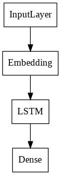
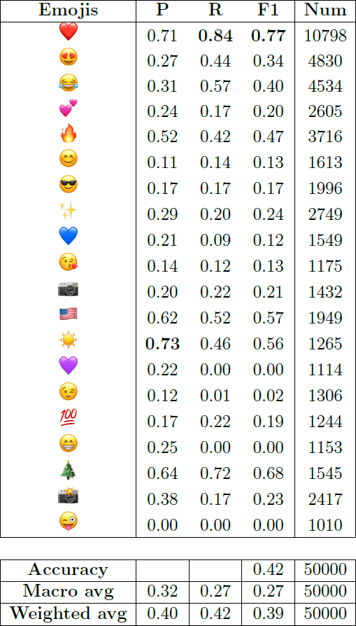
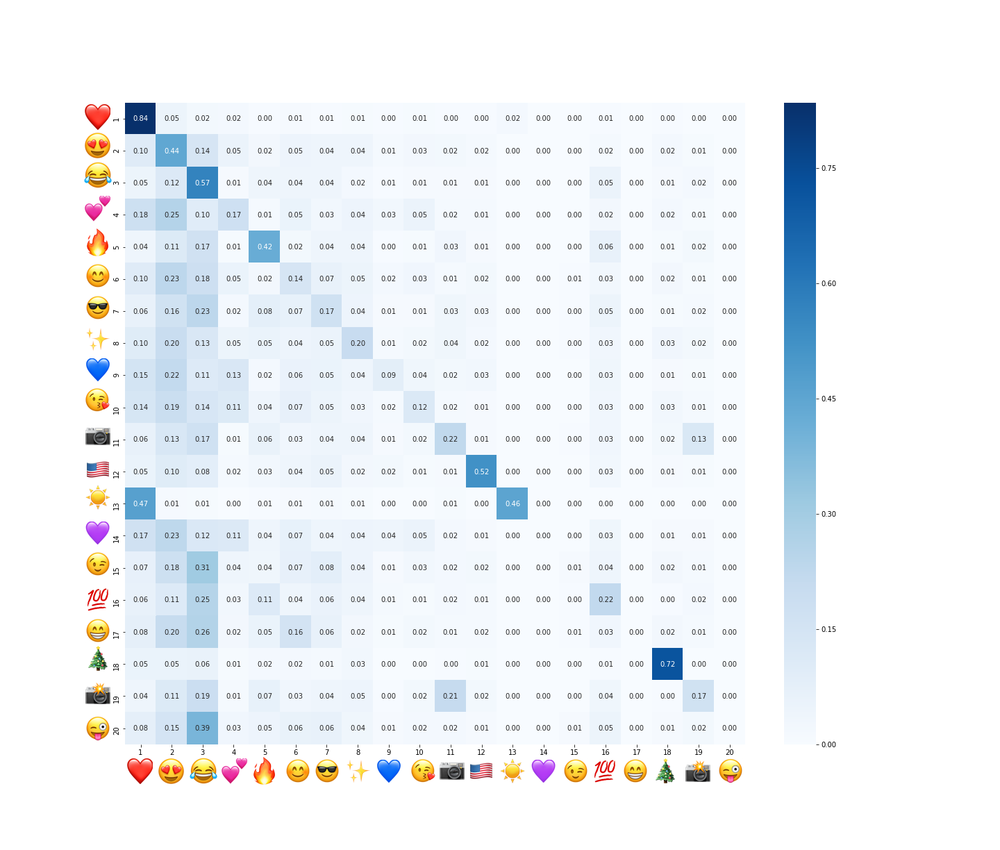

# Emoji predictor
School project using machine learning to guess the emoji used in a tweet based on its content.

## Model

### Word2Vec
The first layer of our model is an embedding layer. We used *word2vec* as it yields good results. We used the *cbow* version with a window of size 5 and an embedding size of 500.

### LSTM
For classification, we used an LSTM as it is the most suited for handling textual data. The last layer is a fully connected layer of size 20.

## Results

### Scores

### Confusion matrix



